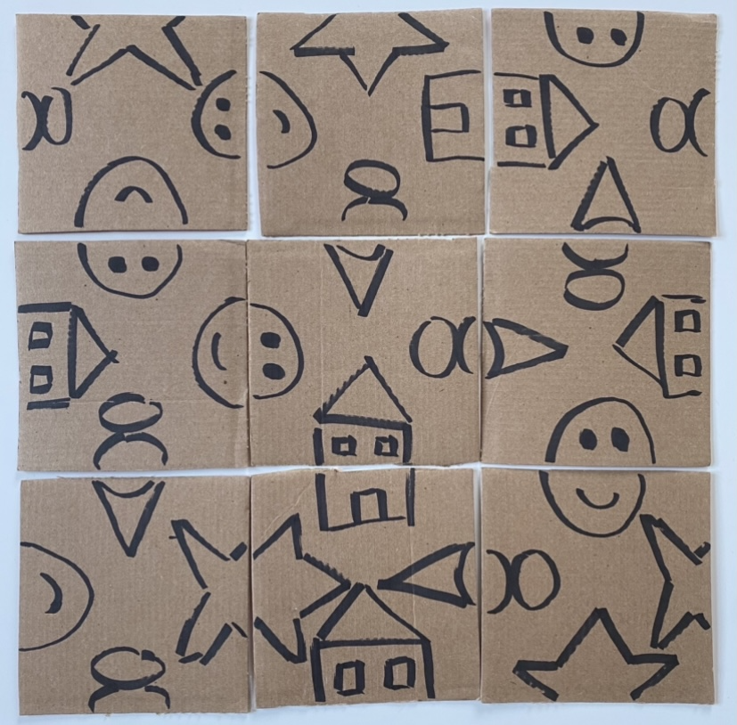

# Scramble Squares Solver
Independent Study, Spring 2021 - Solving Scramble Squares Puzzles using DFS backtracking

Research Papers:

1. Using Backtracking to Solve Scramble Squares Puzzles (https://www.cs.umb.edu/~eb/sam/maccabees/backtrackingPaper.pdf)
2. A Graph Theoretical Approach to Solving Scramble Squares Puzzles (http://users.wfu.edu/masonsk/scramblesquares.pdf)

Deliverables:

1/24 - 2/7: I first want to implement the backtracking solution provided in the 1st research paper on my own. I plan on modeling the solution to the puzzle using the graph theoretical approach given in the 2nd research paper.

2/7 - 2/21: I then want to implement the method of “maximizing the center” given in section 3.1 of the 2nd research paper and investigate the question they leave with the reader on whether this increases the overall efficiency of the algorithm in a significant way.

Additional Exploration:

2/21 - 3/7: I am interested to expand the 3x3 puzzle to larger 4x4 and 5x5 puzzles and note how the efficiency of the algorithm
scales with the size of the puzzle.

3/7 - 3/21: They also suggest a two-sided scramble squares puzzle. I am mostly interested in the challenges this would pose to
the graph theoretical approach. I would guess there would be additional patterns in the recording and solution graphs to these
two-sided puzzles.

3/21 - 4/4: Lastly, and likely most difficult, would be an investigation into the changes to the algorithm required to solve
puzzles with repetitions. Brought up in section 4.1 of the 2nd research paper, repetitions are not handled by the current algorithm, and would require additional conditions to the algorithm and changes to the proof.

Puzzle:

