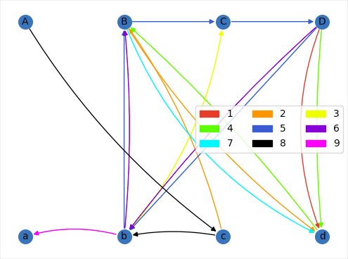

Deliverable 1:

I implemented the backtracking solution following the algorithm given in the first research paper mentioned in the README.md

  https://www.cs.umb.edu/~eb/sam/maccabees/backtrackingPaper.pdf

I represented pieces in my program using Uppercase->Lowercase letters to represent the split tops and bottoms of pictures

  Star = Aa
  Cone = Bb
  House = Cc
  Face = Dd
 
The solution ordered the pieces as follows

  1 2 3 
  4 5 6 
  7 8 9 
 
  and gives the rotation of the piece foolowing bottom->left->top->right
 
  Orientation

  0: bottom edge of piece 
  1: left edge of piece
  2: top edge of piece
  3: right edge of piece
  
  Example: Piece in solution - dBaD
           top edge 
              a
  left edge  B D  right edge 
              d
         bottom edge
         
When running puzzle.py the output given in this form:

  Star = Aa, Cone = Bb, House = Cc, Face = Dd
  bottom:0 left:1 top:2 right:3

  1 2 3
  4 5 6
  7 8 9

  dBaD   BdAc   bCDB
  BCDd   CDbB   DbBC
  Bdba   CAcb   ABda
  
Arranging the pieces matching them with their position and orientation in accordance with the example above will build the solution.

With the solution I then represented teh solution with the solution graph modeled in the second research paper in the README

  http://users.wfu.edu/masonsk/scramblesquares.pdf (examples of solution graphs for a 2x2 puzzle on pgs. 5-6

I made use of networkx to display the solution graph for the solution found by the program. The code in graph_display.py will open up a window with the graph figure. The solution graph for the solution shown in the README looks like this:

The nodes represent split patterns or pictures, and the edge colors are matched with a piece given in the legend. corner pieces have only one edge contributing to the solution, while center outside pieces contribute 2 edges to the solution and the middle piece has 4 edges contributing to the solution. 

Feel free to uncomment the line that shuffles the PIECES at the beginning of the main function in puzzle.py, this will reveal a few alternate solutions as the cards are regarded in a different order by the algorithm
  

  

