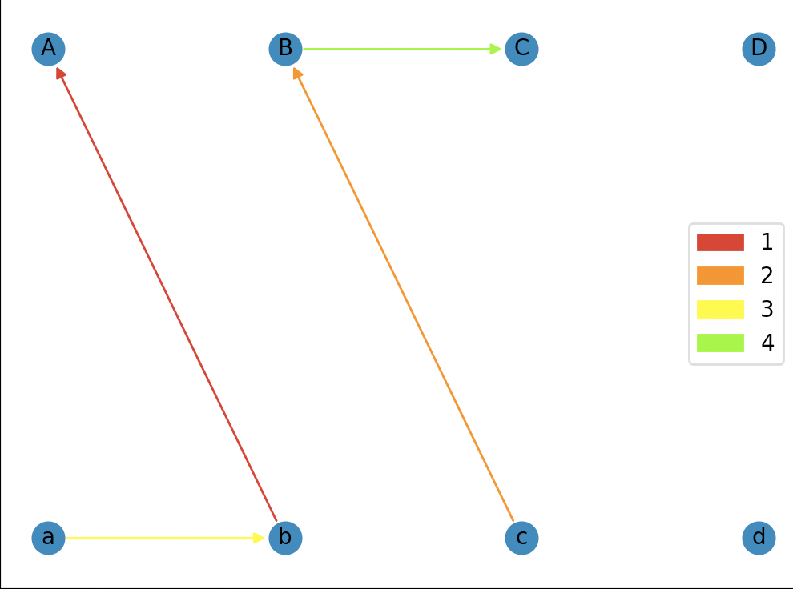
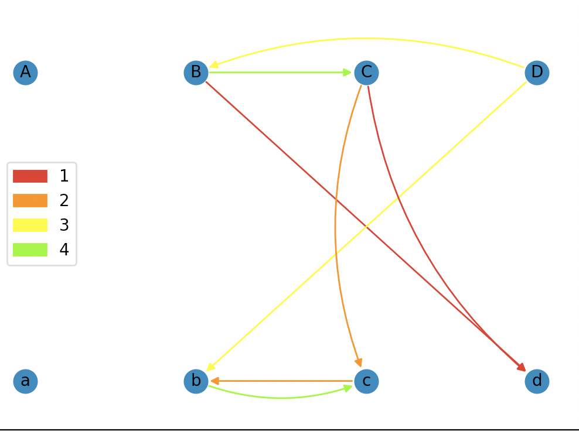

# Deliverable 1

I implemented the backtracking solution following the algorithm given in the first research paper mentioned in the README.md

https://www.cs.umb.edu/~eb/sam/maccabees/backtrackingPaper.pdf

I represented pieces in my program using Uppercase->Lowercase letters to represent the split tops and bottoms of pictures

  Star = Aa<br/>
  Cone = Bb<br/>
  House = Cc<br/>
  Face = Dd<br/>
 
The solution ordered the pieces as follows

  1 2 3<br/>
  4 5 6<br/>
  7 8 9<br/>
 
  and gives the rotation of the piece following bottom->left->top->right
 
  Orientation<br/>

  0: bottom edge of piece <br/>
  1: left edge of piece<br/>
  2: top edge of piece<br/>
  3: right edge of piece<br/>
  
  Example: Piece in solution - dBaD<br/>
&nbsp;&nbsp;&nbsp;&nbsp;&nbsp;&nbsp;&nbsp;&nbsp;&nbsp;&nbsp;&nbsp;top edge<br/>
&nbsp;&nbsp;&nbsp;&nbsp;&nbsp;&nbsp;&nbsp;&nbsp;&nbsp;&nbsp;&nbsp;&nbsp;&nbsp;&nbsp;&nbsp;&nbsp;&nbsp;&nbsp;&nbsp;a<br/>
left edge  B &nbsp; D  right edge <br/>
&nbsp;&nbsp;&nbsp;&nbsp;&nbsp;&nbsp;&nbsp;&nbsp;&nbsp;&nbsp;&nbsp;&nbsp;&nbsp;&nbsp;&nbsp;&nbsp;&nbsp;&nbsp;&nbsp;d<br/>
&nbsp;&nbsp;&nbsp;&nbsp;&nbsp;&nbsp;&nbsp;&nbsp;&nbsp;bottom edge<br/>
         
When running puzzle.py the output given in this form:

  Star = Aa, Cone = Bb, House = Cc, Face = Dd<br/>
  bottom:0 left:1 top:2 right:3<br/>

  1 2 3<br/>
  4 5 6<br/>
  7 8 9<br/>

  dBaD   BdAc   bCDB<br/>
  BCDd   CDbB   DbBC<br/>
  Bdba   CAcb   ABda<br/>
  
Arranging the pieces matching them with their position and orientation in accordance with the example above will build the solution.

With the solution I then represented teh solution with the solution graph modeled in the second research paper in the README

  http://users.wfu.edu/masonsk/scramblesquares.pdf (examples of solution graphs for a 2x2 puzzle on pgs. 5-6

I made use of networkx to display the solution graph for the solution found by the program. The code in graph_display.py will open up a window with the graph figure. The solution graph for the solution shown in the README looks like this:


The nodes represent split patterns or pictures, and the edge colors are matched with a piece given in the legend. corner pieces have only one edge contributing to the solution, while center outside pieces contribute 2 edges to the solution and the middle piece has 4 edges contributing to the solution. 

Feel free to uncomment the line that shuffles the PIECES at the beginning of the main function in puzzle.py, this will reveal a few alternate solutions as the cards are regarded in a different order by the algorithm
  
# Deliverable 2

The idea of maximizing the center is to identify pieces that are most
likely to be middle pieces and check those pieces first, solving the
puzzle in a spiral pattern.

7 8 9\
6 1 2\
5 4 3

Determining which pieces have the most potential to be the middle piece
I used this method:

1.  Count the number of times each picture occurs. This is the index of
    the picture.

2.  Assign a value index to each piece by summing the indices of the
    COMPLEMENTS of the pictures appearing on the piece.

3.  Place the piece with the HIGHEST value index in the middle.

Now when considering the pieces:

PIECES = \[ 'dBaD', 'BdAc', 'bCDB', 'BCDd', 'CDbB', 'DbBC', 'Bdba',
'CAcb', 'ABda' ,\]

We can reorder them with their value index (this work is done in center.py):

PIECES = \[('Bdba', 21), ('bCDB', 20), ('CDbB', 20), ('DbBC', 20), ('dBaD', 18), ('BdAc', 18), ('CAcb', 18), ('BCDd', 17), ('ABda', 16)\]

Pieces with the higher value index have a higher chance of being the
middle piece and allow the algorithm to finish slightly faster compared
to a random arrangement of the pieces which usually doesn't come across
the middle piece as quickly.

I then needed to measure the execution time of the algorithm to compare
ordering the pieces by potential to be the middle and random order. For
this I used time library and took the difference of the start and end
time and displayed the result. Taking the average of 5 test runs for
both arranging the pieces by potential to be middle piece and random
order, here are the results:

**Ordering by middle piece potential:**\
0.03665\
0.03701\
0.03738\
0.03754\
Average: 0.04123

**Random order:**\
0.05226\
0.00350\
0.05193\
0.05546\
Average: 0.04219

Looking at the results, ordering by middle piece did just barely beat
the random ordering, but the results are not that impressive. You can
see the third trial taken with random ordering was very fast. This was a
result of the shuffling of the pieces actually putting the middle piece
is the first slot by chance. This beats the middle piece ordering since
the the middle piece is actually the third in the order when using the
method of ordering by potential to be middle piece. This results in the
ordering by middle piece being very consistently good, but at least for
my puzzle occasionally beaten by random shuffling.

One of the main challenges of this deliverable was getting the board to
solve in a spiral rather than left to right, this was needed since the
middle piece is the first places when solving in a spiral. I also did
work to make the terminal selection better, you can now select whether
you want to order by potential to be middle piece or have them randomly
ordered. You then get to select whether or not you want to generate the
solution graph from deliverable 1, and the puzzle is displayed in a much
more helpful grid format along with the execution time of the run.

# Deliverable 3

First I need to create a 4x4 or 5x5 puzzle with a solution since none currently exist anywhere I can find.

Here is the 4x4 puzzle I decided on, taking into account the added pieces value indicies to make a balanced puzzle. The new 4x4 puzzle has the old 3x3 puzzle as its bottom right corner

ABab aBcC dcbc ACdB\
dBaD BdAc bCDB BbaC\
BCDd CDbB DbBC dcba\
Bdba CAcb ABda bADd\

Solving the 4x4 puzzle in a spiral as I was doing for the 3x3 puzzle to implement maximize the center in Deliverable 3 doesnt work the same for the 4x4 puzzle. The 4x4 puzzle has an even number of pieces and really has 4 middle pieces. For this reason I brought back the old method of solving the puzzle which places the pieces in this order and havent implemented maximizing the center for the bigger puzzle.

 1  2  3  4\
 5  6  7  8\
 9 10 11 12\
13 14 15 16\

Here are the value indicies of the pieces in the 4x4 puzzle. For the 4x4 puzzle the value the value indicies become very good at predicting the 4 middle pieces.

```
[('bCDB', 37), ('CDbB', 37), ('DbBC', 37), ('ABab', 35), ('dcbc', 34), ('BbaC', 34), ('Bdba', 34), ('bADd', 34), ('CAcb', 33), ('dcba', 32), ('dBaD', 31), ('BdAc', 31), ('BCDd', 31), ('aBcC', 30), ('ACdB', 29), ('ABda', 29)]
```

For this I had to define a different SQUARE_LINKS array for the bigger board with 4 rows:

```
SQUARE_LINKS_BIG = (
    # TOP ROW
    ((RIGHT, 1, LEFT), (BOTTOM, 4, TOP),),
    ((LEFT, 0, RIGHT), (BOTTOM, 5, TOP), (RIGHT, 2, LEFT)),
    ((LEFT, 1, RIGHT), (BOTTOM, 6, TOP), (RIGHT, 3, LEFT)),
    ((LEFT, 2, RIGHT), (BOTTOM, 7, TOP)),
    
    # MIDDLE ROW 1
    ((TOP, 0, BOTTOM), (RIGHT, 5, LEFT), (BOTTOM, 8, TOP),),
    ((LEFT, 4, RIGHT), (TOP, 1, BOTTOM), (RIGHT, 6, LEFT), (BOTTOM, 9, TOP)),
    ((LEFT, 5, RIGHT), (TOP, 2, BOTTOM), (RIGHT, 7, LEFT), (BOTTOM, 10, TOP)),
    ((LEFT, 6, RIGHT), (TOP, 3, BOTTOM), (BOTTOM, 11, TOP)),

    # MIDDLE ROW 2
    ((TOP, 4, BOTTOM), (RIGHT, 9, LEFT), (BOTTOM, 12, TOP),),
    ((LEFT, 8, RIGHT), (TOP, 5, BOTTOM), (RIGHT, 10, LEFT), (BOTTOM, 13, TOP)),
    ((LEFT, 9, RIGHT), (TOP, 6, BOTTOM), (RIGHT, 11, LEFT), (BOTTOM, 14, TOP)),
    ((LEFT, 10, RIGHT), (TOP, 7, BOTTOM), (BOTTOM, 15, TOP)),

    # BOTTOM ROW 
    ((TOP, 8, BOTTOM), (RIGHT, 13, LEFT)),
    ((LEFT, 12, RIGHT), (TOP, 9, BOTTOM), (RIGHT, 14, LEFT)),
    ((LEFT, 13, RIGHT), (TOP, 10, BOTTOM), (RIGHT, 15, LEFT)),
    ((LEFT, 14, RIGHT), (TOP, 11, BOTTOM)),
)
```

Now comparing the efficiency of solving the 3x3 puzzle vs the 4x4 puzzle. Again I will do 5 test runs and take the average.

3x3 puzzle:

0.01832\
0.00872\
0.05721\
0.03720\
0.02396\

Average: 0.029082\

4x4 puzzle:

3.19725\
1.96208\
1.23899\
2.04518\
0.12017\

Average: 1.712734\

The numbers show that solving the 4x4 puzzle takes significantly longer. As the puzzle grows the time it takes to sovle it grows exponentially. I would guess that if I were to expand the puzzle to 5x5 or 6x6 with the current algorithm the time taken would be too much for the program to be convienient.

# Deliverable 4

For the two sided puzzle I made a quick 2x2 puzzle to make things simpler and so the recording and solution graphs are clearer as they are in the second research paper in the readme. The 2x2 puzzle has more solutions than the 3x3, here is an example of a 2x2 solution graph similar to what we see in the research paper on page 6



The solutions graph are solutions according to these 3 rules:

1. Each edge is a different color.
2. The in-degree of each vertex is equal to the out-degree of its
complement.
3. If X −→ A −→ Y is a directed path in Gs(P), then Y must be
the complement of X.

The goal of this deliverable is to create a method of generating 2x2 two-sided puzzles and then observe thier solution graphs with these rules related to the proof in mind.

Once the program solves the 2x2 puzzle one method of generating a two sided puzzle is to just to add the same images to the other side, or some have some rule for changing the images for the other side so its a little more interesting. Another method is to generate a random picture for each link in the solution and put it on the other side.

Example two sided puzzle using random method:

```

side 1:

  a     C
b   B b   A
  d     c

  D     C
C   b B   D
  B     d


side 2 (generated with random method):

  a     C
b   C c   A
  d     C

  D     c
C   B b   D
  B     d


```

Here is a nice looking solution graph mapping edges from both sides of the puzzle above:



As you can see a two sided puzzle is just two different solutions graphs each following the rules layered on top of eachother.The different colors represent the different pieces and now each have two edges since we now have two sides and one solution graph edge per piece for all for pieces with the 2x2 puzzle. 


